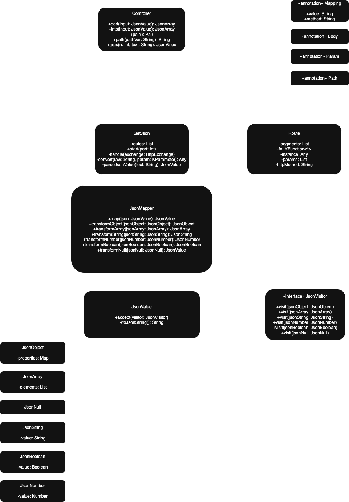

# Advanced Programming Project 2024/2025

This repository contains two Kotlin modules for the Advanced Programming course:

1. **JSON Manipulation Library** (Phase 1 & 2)
2. **GetJson HTTP Framework**

---

## Part 1: JSON Manipulation Library

### Overview

A pure-Kotlin library for in-memory JSON modelling, manipulation, and serialization. No external dependencies are used, except JUnit for testing.

### Features

* **Model**: Classes for all JSON value types:

  * `JsonObject`
  * `JsonArray`
  * `JsonString`
  * `JsonNumber`
  * `JsonBoolean`
  * `JsonNull`
* **Filtering**:

  * `JsonObject.filter(predicate)` → new `JsonObject`
  * `JsonArray.filter(predicate)` → new `JsonArray`
* **Mapping**:

  * `JsonArray.map(transform)` → new `JsonArray`
* **Visitor Pattern**:

  * Traverse any JSON tree via `JsonVisitor` interface
  * Sample visitor implementations to:

    * Validate object keys
    * Ensure arrays are homogeneous (non-null)
* **Serialization**:

  * `toJsonString()` produces standard-compliant JSON text
* **Reflection-based Inference** (Phase 2)

  * Convert Kotlin data classes, lists, maps, enums, and primitives into the JSON model
  * Supports nested structures via recursive reflection

### Usage Example

```kotlin
// Programmatic construction
overval obj = JsonObject(mapOf(
  "name" to JsonString("Alice"),
  "age"  to JsonNumber(30)
))
println(obj.toJsonString()) // {"name":"Alice","age":30}

// Reflection-based inference
data class Course(
  val name: String,
  val credits: Int,
  val evaluation: List<EvalItem>
)
// ... define EvalItem and EvalType ...

val course = Course("PA", 6, listOf(
  EvalItem("quizzes", 0.2, false, null),
  EvalItem("project", 0.8, true, EvalType.PROJECT)
))
val inferred = course.toJsonValue()     // uses JsonMapper + reflection
println(inferred.toJsonString())
```

### Documentation

All public API elements are documented via **KDoc**. Consult the source for details.

### Testing

All unit tests are implemented using **JUnit** only, with no third-party libraries.
Tests can be executed with the Gradle wrapper included in this repository (no additional setup required):

**On Unix/macOS:**

```bash
./gradlew test
```

**On Windows (PowerShell):**

```powershell
gradlew.bat test
```

---

## Part 2: GetJson HTTP Framework

### Overview

A lightweight Kotlin framework that:

* Exposes `@Mapping`-annotated classes and methods as HTTP GET endpoints
* Binds path segments (`@Path`) and query parameters (`@Param`) into function arguments
* Serializes return values via the JSON library above

No external dependencies are used, except JUnit for testing. The framework relies solely on the Kotlin and Java standard libraries.

### Usage Example

```kotlin
fun main() {
  val app = GetJson(Controller::class)
  app.start(8080)
}

// Controller.kt
@Mapping("api")
class Controller {
  @Mapping("ints")
  fun ints(): JsonArray = listOf(1,2,3,4,5).toJsonValue() as JsonArray

  @Mapping("pair")
  fun pair(): Pair<String,String> = Pair("one","two")

  @Mapping("path/{id}")
  fun path(@Path id: String): String = id + "!"

  @Mapping("args")
  fun args(@Param n: Int, @Param text: String): JsonValue =
    JsonObject(mapOf(text to JsonString(text.repeat(n))))
}
```

Available endpoints:

| Path                    | Response                             |
| ----------------------- | ------------------------------------ |
| `/api/ints`             | `[1,2,3,4,5]` filtered in controller |
| `/api/pair`             | `{"first":"one","second":"two"}`     |
| `/api/path/abc`         | `"abc!"`                             |
| `/api/args?n=3&text=PA` | `{"PA":"PAPAPA"}`                    |

### Testing

All integration tests for HTTP endpoints use **JUnit** and the Java HTTP client from the standard library (`java.net.HttpURLConnection`).

Run tests with Gradle:

```bash
gradlew test
```

---

## Project Structure

```
├── json-lib/           # JSON library module
│   ├── src/main/kotlin/models
│   ├── src/main/kotlin/mappers
│   └── src/test/kotlin
└── http-framework/     # GetJson framework module
    ├── src/main/kotlin/framework
    └── src/test/kotlin
```

## UML Class Diagram




## Release

* **JAR** artifacts published under `releases/`
* Versioned following Semantic Versioning (e.g., `v1.0.0`)

---

## License

MIT © 2025 Pedro Pascoal
